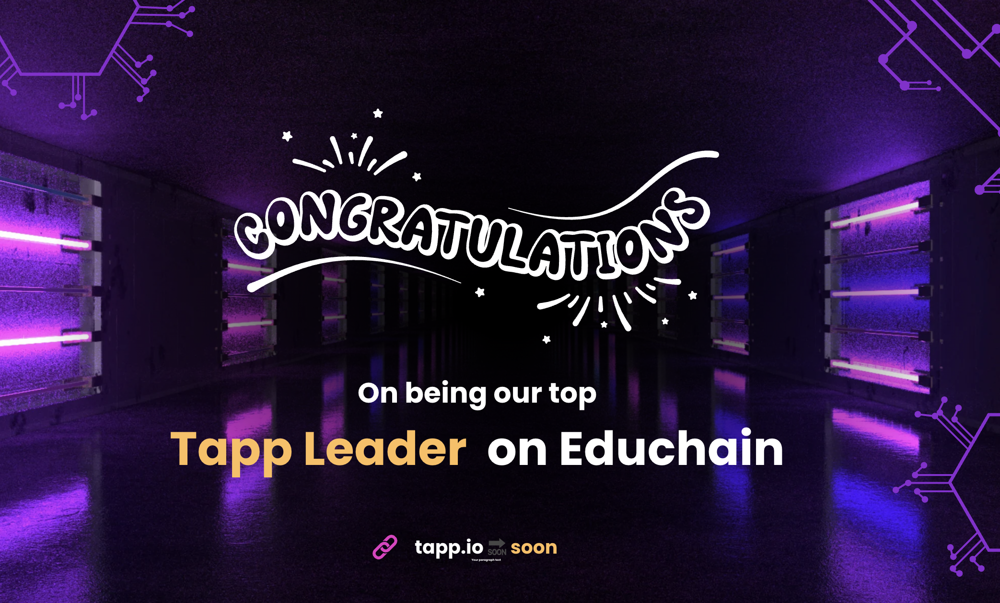
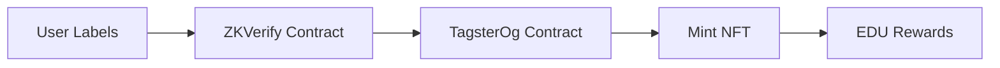

*Building the future of private, incentivized data labeling on EDUChain* 🚀
## Video Link : https://www.loom.com/share/5da783c74c444e959a500abf7afc2e2b?sid=913ce085-cb36-4212-bc15-e316007d903f
<div style="position: relative; padding-bottom: 65.03918022905366%; height: 0;"><iframe src="https://www.loom.com/embed/5da783c74c444e959a500abf7afc2e2b?sid=ed07ac31-c28a-4ea7-8003-b846bd114ec7" frameborder="0" webkitallowfullscreen mozallowfullscreen allowfullscreen style="position: absolute; top: 0; left: 0; width: 100%; height: 100%;"></iframe></div>
# Tagster: Gamified Data Labeling for AI Models 🚀

Welcome to Tagster! Our platform turns the task of labeling data into a fun, engaging, and rewarding experience. By gamifying data labeling, Tagster provides a unique way for users to contribute to AI development, while earning passive income. Companies upload their data, and users can label it through a TikTok/Instagram-like interface—making it easy and enjoyable to help AI models grow smarter.

## 🌟 Features

- **Gamified Labeling**: Swipe through content like images and short-form videos to provide labels, just like you do on Instagram or TikTok!
- **Passive Income**: Earn rewards for labeling data and contributing to AI model improvements
- **Transparent & Secure**: Built on the EDU Chain with zkVerify, ensuring data integrity and user anonymity
- **NFT Rewards**: Labeling data earns you an NFT certificate, stored on the EDU Chain, validating your contribution
- **Decentralized Science (DeSci)**: Support decentralized AI development while earning rewards


## 🔗 Smart Contract Ecosystem

### 🎨 NFT Contracts
```solidity
// Tagster OG NFT - Exclusive Membership
// Deployed on EDUChain Codex
```
[](https://opencampus-codex.blockscout.com/tx/0x22a90467cde1ed901a13eeb620b39982efb5307dc881b89f19addc71785f215c)

### 🏷️ Labeling Contract
```solidity
// TagsterOg - Core Labeling Logic
// Deployed on EDUChain Testnet
```
[](http://edu-chain-testnet.blockscout.com/tx/0x22a90467cde1ed901a13eeb620b39982efb5307dc881b89f19addc71785f215c)

### 🔐 ZK Verification
```solidity
// ZKVerify - Privacy Layer
// Deployed on ZKVerify Network
```
[](https://zkverify-explorer.zkverify.io/blocks/0x1888fb37288acaabe8b6352459afc99a93684bdef27126d1f5a78cba2fe6ac9d)

## 🌟 Key Features

### 🔐 Privacy-First Data Labeling
- **Zero Knowledge Proofs**: Label data without revealing your specific answers
- **On-chain Verification**: All labels are verified using ZK proofs on EDUChain
- **Private Contribution**: Contribute to AI datasets while maintaining privacy

### 💰 EDUChain Integration
- **Instant Rewards**: Earn EDU tokens for verified labels
- **Smart Contract Integration**: Automated reward distribution
- **Transparent Earnings**: Track your earnings in real-time

### 🎯 Use Cases

1. **AI Dataset Creation**
   - Create high-quality labeled datasets for AI training
   - Ensure data quality through consensus mechanisms
   - Maintain labeler privacy while ensuring accuracy

2. **Educational Data Collection**
   - Students can earn while learning
   - Universities can gather research data
   - Privacy-preserved academic dataset creation

3. **Medical Image Labeling**
   - Private medical image classification
   - Expert verification without data exposure
   - HIPAA-compliant data handling

## 🔄 Contract Interaction Flow



## 🚀 Getting Started

1. **Install Dependencies**
   ```bash
   npm install
   ```

2. **Configure Environment**
   ```bash
   cp .env.example .env
   # Add your EDUChain and ZKVerify credentials
   ```

3. **Run Development Server**
   ```bash
   npm run dev
   ```

## 🔧 Technical Architecture

### ZKVerify Integration
```typescript
const verifyLabels = async () => {
  // Generate ZK proof for labels
  const proof = await generateProof(labels);
  
  // Verify on EDUChain
  await zkVerifySession
    .verify()
    .groth16(Library.snarkjs)
    .execute(proof);
}
```

### EDUChain Smart Contract
```solidity
contract LabelRewards {
    // Reward distribution for verified labels
    function claimReward(bytes32 proofHash) external {
        require(verifyZKProof(proofHash), "Invalid proof");
        // Transfer EDU tokens
    }
}
```

## 🔒 Privacy Features

1. **Zero Knowledge Label Verification**
   - Prove correctness without revealing answers
   - Maintain data labeler anonymity
   - Prevent gaming of the reward system

2. **On-chain Privacy**
   - All transactions are on EDUChain
   - ZK proofs ensure data privacy
   - Transparent reward distribution

## 💡 How It Works

1. **Select Category**
   - Choose from various labeling categories
   - View task requirements
   - Start labeling session

2. **Label Data**
   - Swipe right for Yes, left for No
   - Complete sets of 3 labels
   - Generate ZK proof

3. **Verify & Earn**
   - ZK proof verification
   - Automatic EDU token rewards
   - Track earnings in wallet


## 🤝 Contributing

We welcome contributions! Please see our [Contributing Guidelines](CONTRIBUTING.md) for details.

## 📄 License

This project is licensed under the MIT License - see the [LICENSE](LICENSE) file for details.

## 🙏 Acknowledgments

- EDUChain Team for blockchain infrastructure
- ZKVerify for zero knowledge proof implementation
- Community contributors and data labelers

## 📞 Contact & Social

[](https://twitter.com/imbuddyharshal)


---

<div align="center">

Built with ❤️ by the Tagster Team


</div> 
